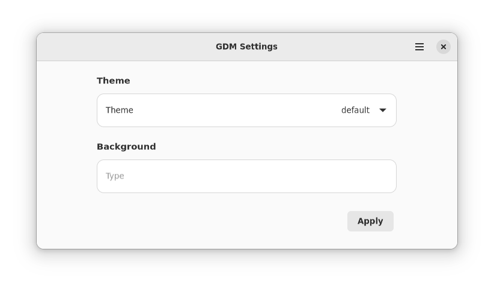

# gdm-settings

An app to change settings of Gnome's Display/Login Manager.

It is written in Python and provides a Graphical interface using GTK+ library. It is an alternative to '[gdm-tools](https://github.com/realmazharhussain/gdm-tools.git)'  which is written in bash and has no Graphical Interface.

## Important Note! (Alpha-Stage Software)

This app is in very early stage of development. So, it has only a small number of features and may crash frequently. Also, every aspect of this app is subject to significant change.

## What works in Graphical Interface?

- Apply themes

## What works in Command-line Interface?

- Apply themes
- Create/Restore a backup of the default theme
- Extract default theme for use in gnome-shell

## What works with some issues?

**Note:** These issues are planned to be resolved

- Change Background Image
  **Issues:**
  - You need to manually put an image as the file `/usr/share/gnome-shell/theme/gdm-background` (Note: no extension)
- Apply Custom Styling to a Theme
  **Issues:**
  - You need to manually create CSS file `/etc/gdm-settings/custom.css` and put your custom CSS code in there

## How to Install?

Currently there is no way to install this app. Just clone the git repository and double-click on the file 'gdm-settings' to run the app or manually integrate it with the system by using the desktop file.

## Issues to be resolved

- No easy method to install the app
- No icon for the app

## Planned Features

- Change background image/color (partially done)
- Change icon theme
- Change cursor theme
- Night light settings
- Show/Hide battery percentage
- Touchpad settings (speed, tap-to-click)
- Clock settings (show/hide weekday, AM/PM or 24h)
- Tweak the theme before applying it. For example, 
  - make text white or black
  - disable arrows in top bar
  - make top bar partially/fully transparent
- Add user-specified CSS to  the theme before applying it (partially done)
- A command-line interface (partially done)
- Tab-completion for the command-line interface

