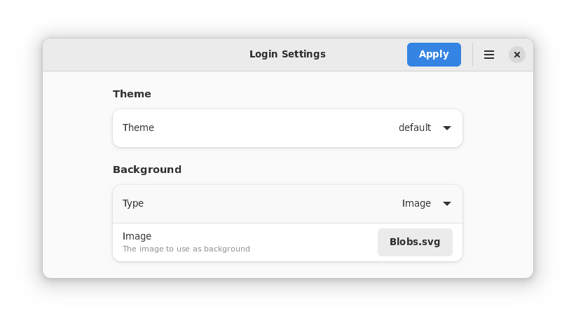

# Login Settings (gdm-settings)

An app to change settings of Gnome's Display/Login Manager.

It is written in Python and provides a Graphical interface using GTK+ and LibAdwaita. It is an alternative to '[gdm-tools](https://github.com/realmazharhussain/gdm-tools)'  which is written in bash and has no Graphical Interface.

## Important Note! (Alpha-Stage Software)

This app is in an early stage of development (it is mostly feature complete). It may crash frequently.

## Features

- Apply themes
- Set Image/Color as Background
- Theme (Top Bar) Tweaks
  - Disable arrows
  - Disable rounded corners
  - Change text color
  - Change background color & transparency (either both or none)
- Change icon theme
- Change cursor theme
- Change sound theme
- Night light settings
- Show/Hide battery percentage
- Touchpad settings (speed, tap-to-click)
- Clock settings (show/hide weekday, AM/PM or 24h)

**Note:** See [Planned Features](#planned-features) for upcoming features

## How to Install?

### Manual Installation

0. Make sure all build-time and run-time dependencies are installed
1. Download and extract this [zip file](https://github.com/realmazharhussain/gdm-settings/archive/refs/heads/main.zip) (or this [tar.gz file](https://github.com/realmazharhussain/gdm-settings/archive/refs/heads/main.tar.gz))\
   OR\
   Clone this repository. You can do so with the command `git clone --depth=1 --singe-branch https://github.com/realmazharhussain/gdm-settings`
2. Go to the folder where you extracted/cloned this file/repo
3. Open your terminal application in that folder
4. Type `meson build` and press Enter
5. Type `meson install -C build` and press Enter
5. Type your password and press Enter

### Arch-based distros

This app is available in the AUR as [gdm-settings](https://aur.archlinux.org/packages/gdm-settings) and [gdm-settings-git](https://aur.archlinux.org/packages/gdm-settings-git). You can install it using your favorite AUR helper.

## Dependencies

### Run-time Dependencies

- LibAdwaita-1
- Glib-2 (development version)
- python-gobject a.k.a PyGObject

### Build-time Dependencies

- Meson

## Planned Features

- Set a gradient as the background
- Apply blur effect to the background image
- A command-line interface
- Tab-completion for the command-line interface

